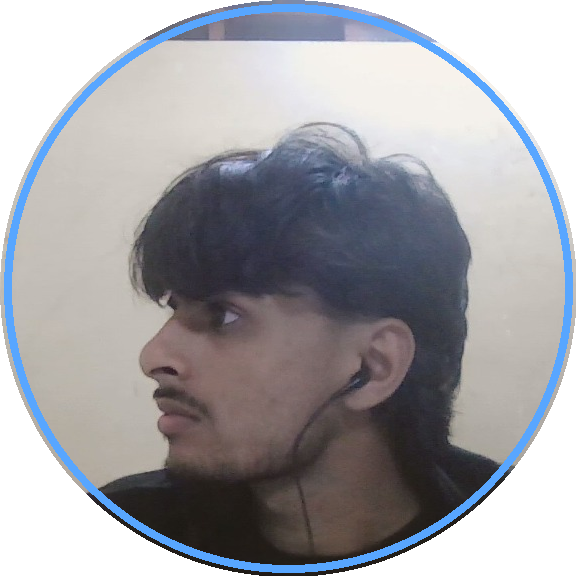

   
  
  
  # Ayush Singh
  
  `Full-Stack Developer` &nbsp;•&nbsp; `Competitive Programmer`
  
  *Translating complex algorithmic ideas into clean, lightweight web applications.*

  

    
    
    
  

---

### 🛰️ The Orbit

I am a Full-Stack Developer and Competitive Programmer dedicated to building scalable web applications and optimizing performance. I focus on writing clean, modular code while actively solving algorithmic challenges.

- 🚀 **Core Focus**: MERN Stack (MongoDB, Express, React, Node.js) & Next.js.
- 🏆 **Competitive Programming**: Active problem solver on LeetCode & Codeforces.
- 💡 **Philosophy**: "Write code that is easy to read, hard to break, and lightning fast."

---

### 🛠️ Tech Stack & Tools

  
  
  

  
  
  

  
  
  
  
  

---

### 📊 System Telemetry

  
  &nbsp;&nbsp;
  

  
  &nbsp;&nbsp;
  

---

### 📡 Establish Connection

  
  
  
  

 

  Designed with 🌌 Antigravity theme. Built by Ayush Singh.

